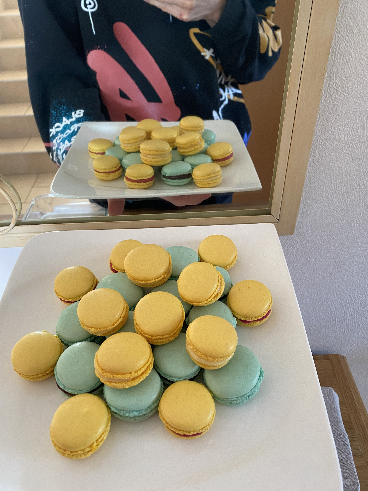
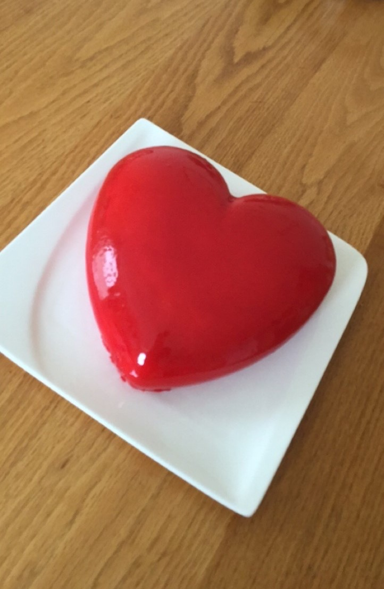
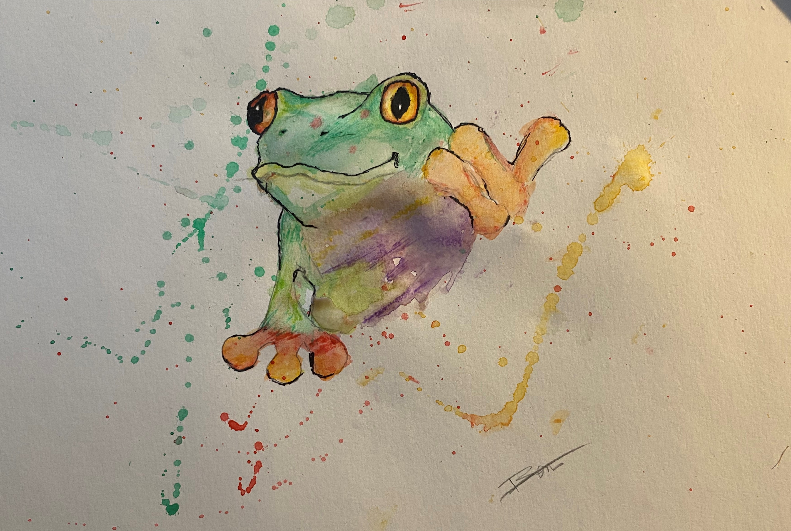

#### Bonjour 👋

### Presentation

- Je m'appelle Benjamin
- J'ai 18 ans
- Je suis en Terminal avec les options Maths et NSI 

### Projets

- Demineur Sur la calculatrise Numworks
  https://github.com/bjt2017/DemineurNumworks

- Projet sur Pygame pour la specialité NSI
  https://github.com/bjt2017/Projet-pygame

- Un morpion avec une IA qui joue contre vous
  https://github.com/bjt2017/Morpion-avec-IA

### Mes hobbies

#### En dehors de la l'informatique mes autres hobbies:

##### La Pâtisserie 

###### Macaron              

            

###### Entremets Fraise & Framboise

##### Dessin

